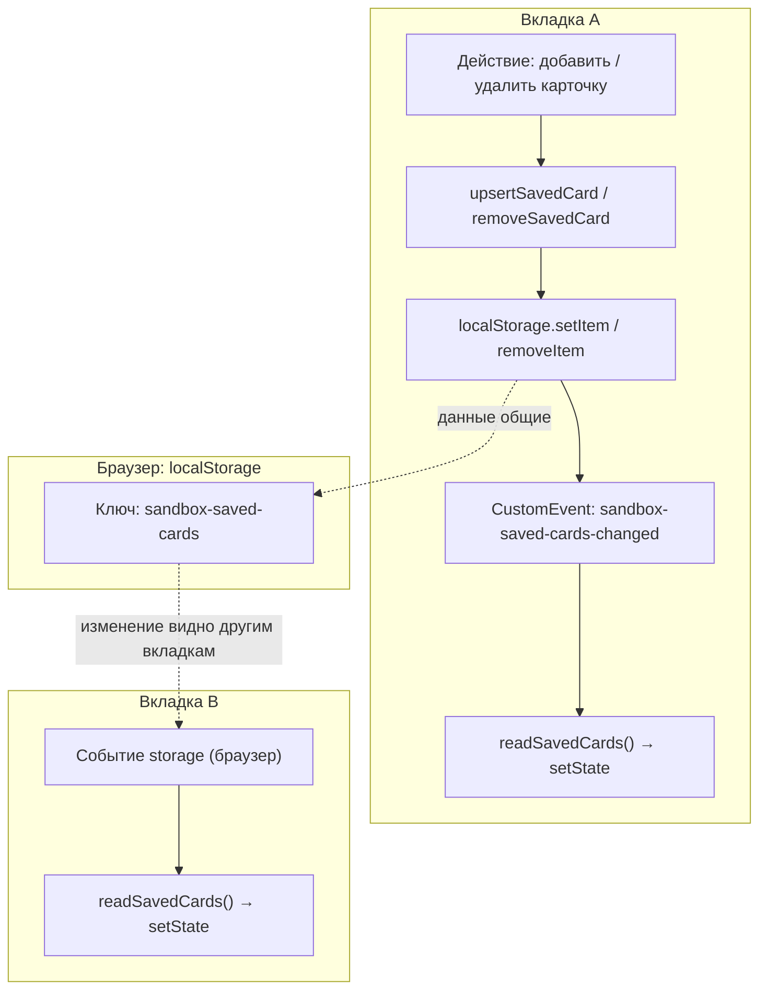
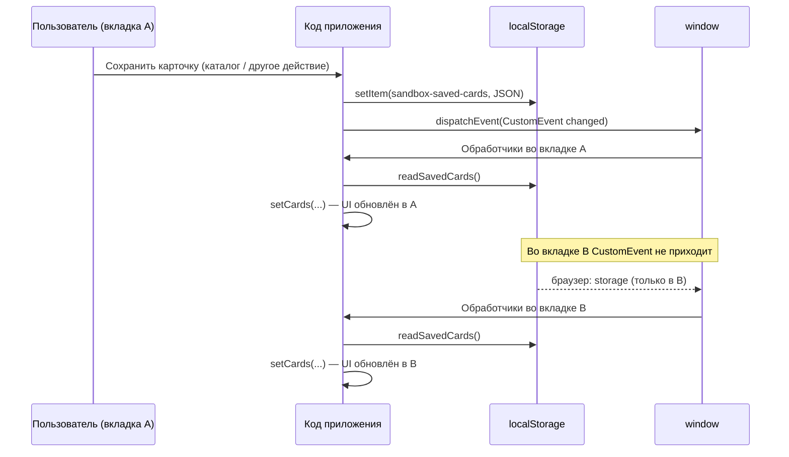
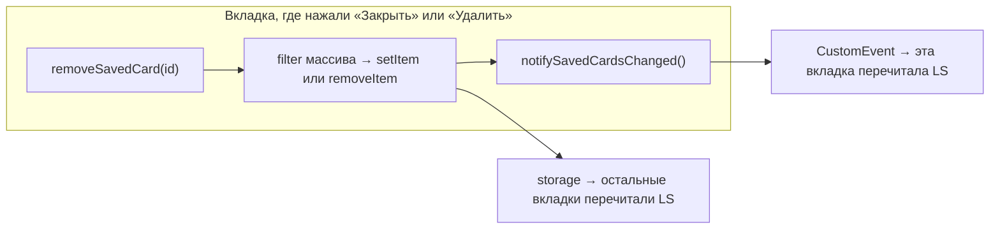

# React-приложение (песочница)

## Запуск проекта

Нужны **два терминала**: сначала бэкенд, затем фронт (Vite проксирует `/api` на Fastify).

Перейдите в **корень репозитория** `Sand_Box` (рядом лежат папки `backend` и `react-app`).

1. **Бэкенд** (Fastify, порт **3000**):

   ```bash
   cd backend
   npm install
   npm run dev
   ```

2. **Фронт** (Vite, порт **5173**, прокси `/api` → `http://localhost:3000`):

   ```bash
   cd react-app
   npm install
   npm run dev
   ```

3. Откройте в браузере **`http://localhost:5173`**. Логин для теста: **`demo`**, пароль: **`demo123`**.

Сборка фронта (из `react-app`): `npm run build`.

Если терминал уже открыт в `react-app`, бэкенд: `cd ../backend` и команды из шага 1.

---

## Синхронизация карточек между вкладками

Карточки хранятся в **`localStorage`** под ключом `sandbox-saved-cards` (массив объектов). Для одного origin (например `http://localhost:5173`) это хранилище **общее для всех вкладок**: после записи данные уже «одинаковые» на диске браузера.

Чтобы **интерфейс** во всех вкладках обновился без перезагрузки, используются два механизма:

1. **Текущая вкладка** — после любой записи в `localStorage` вызывается кастомное событие `sandbox-saved-cards-changed` (в коде — `SAVED_CARDS_CHANGED_EVENT`). Компоненты подписаны на него и заново читают массив из `localStorage`.
2. **Другие вкладки** — браузер сам генерирует событие **`storage`** на `window`; в обработчике снова читается `localStorage` и обновляется состояние React.

Событие **`storage`** не приходит в той вкладке, которая сама вызвала `setItem` / `removeItem`, поэтому одного только `storage` недостаточно.

Ниже — концептуальные блок-схемы в Mermaid.

### Общая архитектура



### Создание или обновление карточки (одна вкладка пишет)



### Удаление карточки



### Связь с «сессией» (JWT)

Серверная сессия (**httpOnly cookie** после логина) задаёт, **кто** может работать с приложением (например, открыт каталог). Сами карточки по-прежнему лежат во **`localStorage`** и синхронизируются между вкладками по схеме выше. При **выходе** из аккаунта список карточек в `localStorage` очищается вместе с cookie на стороне клиента (см. `AuthContext`).
